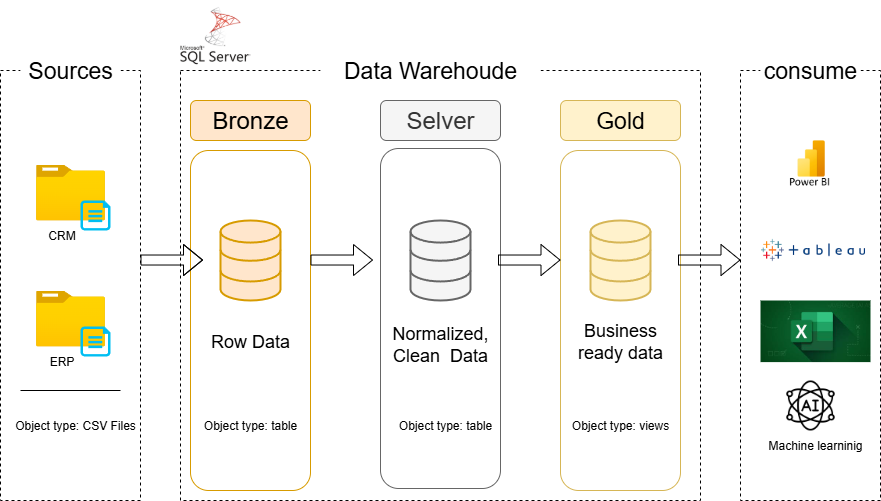
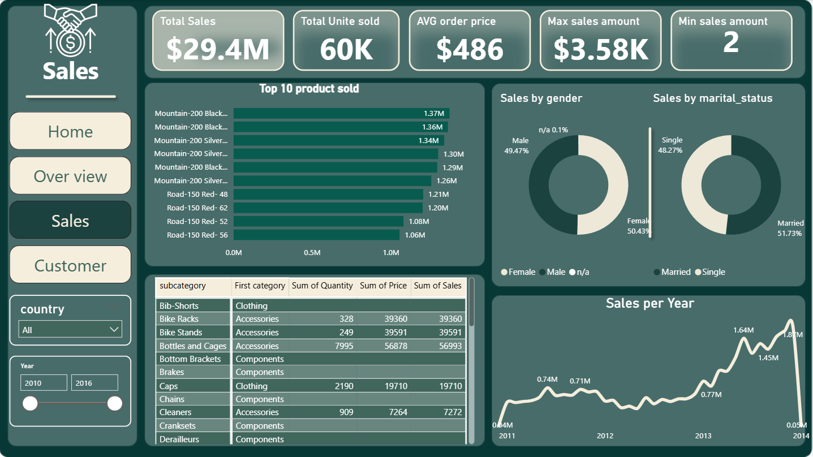
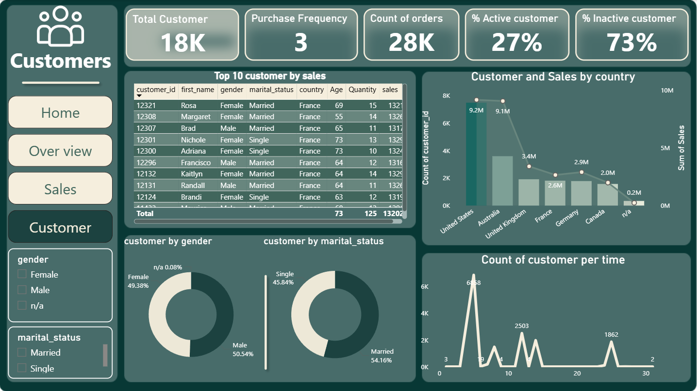

# 📊 SQL Data Warehouse & Analytics Dashboard Project  

Welcome to the **Data Warehouse and Analytics Project** repository! 🚀  
This project demonstrates a complete **data warehousing and business intelligence solution**, starting from building a Data Warehouse to creating interactive **Power BI dashboards** that generate actionable insights.  

---

## 🏗️ Data Architecture  

The project follows the **Medallion Architecture** (Bronze, Silver, Gold):  

  

1. **Bronze Layer** → Raw data ingestion from **ERP & CRM systems**.  
2. **Silver Layer** → Data cleansing, transformations, and normalization.  
3. **Gold Layer** → Business-ready data modeled into a **Star Schema**, used as the single source of truth for reporting.  

**Main Source Tables:**  
- CRM: `crm_sales_details`, `crm_prd_info`, `crm_cust_info`  
- ERP: `erp_px_cat_g1v2`, `erp_cst_az12`, `erp_loc_a101`  

---

## 📖 Project Overview  

- **Data Architecture**: Modern layered approach (Bronze/Silver/Gold).  
- **ETL Pipelines**: SQL-based extraction, transformation, and loading.  
- **Data Modeling**: Star schema design with fact & dimension tables.  
- **Analytics & Reporting**: Power BI dashboards with interactive KPIs.  

🎯 **Skills showcased**:  
- SQL Development  
- ETL Pipelines  
- Data Modeling (Star Schema)  
- Data Analytics (KPIs & Metrics)  
- Business Intelligence with Power BI  

---

## 📂 Repository Structure  

```plaintext
SQL_Data_Warehouse_Project/
│
├── datasets/                           # Raw ERP & CRM datasets
│
├── docs/                               # Documentation & diagrams
│   ├── etl.drawio                      # ETL process diagram
│   ├── data_architecture.drawio        # Project architecture diagram
│   ├── data_catalog.md                 # Dataset catalog & metadata
│   ├── data_flow.drawio                # Data flow diagram
│   ├── data_models.drawio              # Star schema model
│   ├── dashboard_documentation.docx    # Power BI dashboard documentation
│   └── screenshots/                    # Dashboard screenshots
│       ├── overview.png
│       ├── sales.png
│       └── customers.png
│
├── scripts/                            # SQL scripts for ETL
│   ├── bronze/                         # Raw data ingestion
│   ├── silver/                         # Cleaned & transformed data
│   └── gold/                           # Star schema ready data
│
├── dashboards/                         # Power BI dashboards (.pbix)
│
├── tests/                              # Test queries & data quality checks
│
├── README.md                           # Project overview
└── requirements.txt                    # Dependencies
```

📊 Analytics & Reporting
The Power BI dashboard consists of 4 interactive pages:

Home Page → Navigation & description of report pages.

Overview Page → High-level KPIs and business performance.

Sales Page → Metrics on sales, units sold, top products, demographics, and yearly trends.

Customers Page → Customer activity, demographics, segmentation, and retention metrics.

## Dashboard Screenshots
🔹  Overview
  

🔹 Sales
  

🔹 Customer
  


🔹 Key KPIs
Total Sales & Units Sold

Average Order Price

Active vs. Inactive Customers %

Customer Purchase Frequency

Top 10 Products Sold

Sales by Gender & Marital Status

Sales Trend per Year

🔹 Recommendations
Customers:

Develop a Retention Plan for inactive customers.

Focus on most active age groups in campaigns.

Launch a Loyalty Program for high-frequency customers.

Sales:

Monitor inventory for Top 10 products.

Create Targeted Marketing Campaigns by gender & marital status.

Leverage Seasonal Sales Peaks with pre-planned promotions.

General:

Benchmark KPIs against strategic targets.

Prepare monthly monitoring reports.

Use Feedback & Ratings to enhance product quality.

🌐 Connect with Me
I’m Ahmed Anwer Fath 👋
📌 Passionate about Data Warehousing, ETL, SQL Development, and Business Intelligence.

🔗 LinkedIn

🖥️ GitHub

🛡️ License
This project is licensed under the MIT License.
You are free to use, modify, and share with proper attribution.
